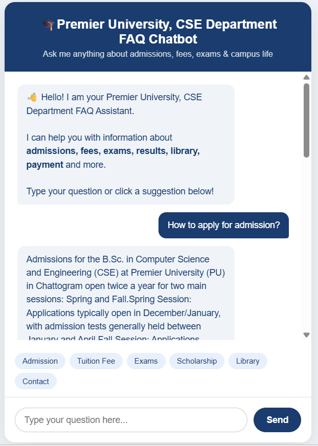

# premier-university-cse-chatbot
FAQ Chatbot for Premier University, CSE Department, Chattogram
# 🎓 Premier University CSE Department FAQ Chatbot

A rule-based FAQ chatbot for the CSE Department of Premier University,
Chattogram. Built with Python and Flask.

## Screenshot

## Features
- Answers 25+ real questions about Premier University CSE department
- Topics covered:
  - Admissions (Spring & Fall session, eligibility, documents)
  - Fees (semester cost, total degree cost, payment via UCB bank)
  - Scholarships & fee waivers based on SSC/HSC results
  - Exams & Results (midterm, final, CGPA requirements)
  - Library timings and rules
  - Campus facilities (WiFi, cafeteria)
  - Contact info and office location
- Quick suggestion buttons for common questions
- Clean chat interface with typing indicator
- Instant responses — no internet or AI API required

## How to Run
1. Install Python from python.org
2. Install Flask:
   pip install flask
3. Download app.py and place index.html inside a templates/ folder:
   premier-university-cse-chatbot/
   ├── app.py
   └── templates/
       └── index.html
4. Open terminal in the project folder and run:
   python app.py
5. Open your browser and go to:
   http://127.0.0.1:5000

## Sample Questions You Can Ask
- How to apply for admission?
- What is the tuition fee?
- What is the eligibility criteria?
- When are the exams?
- What is the minimum CGPA to pass?
- Is hostel available?
- Library timings?
- How to get scholarship?
- Contact information

## Built With
- Python
- Flask (web framework)
- HTML & CSS (frontend UI)
- JavaScript (real-time chat interface)

## Developer
CSE Graduate — Premier University, Chattogram
