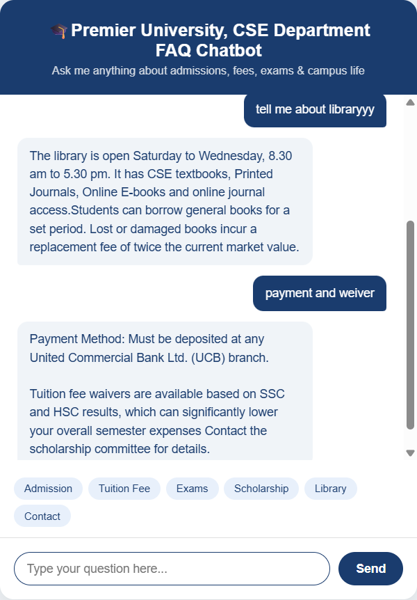

# 🎓 Premier University CSE Department FAQ Chatbot

A smart FAQ chatbot for the CSE Department of Premier University, Chattogram.
Built with Python and Flask, powered by fuzzy matching for natural language understanding.

## Screenshot

## Features
- Answers 25+ real questions about Premier University CSE department
- **Fuzzy matching** using RapidFuzz — understands typos and natural phrasing
  (e.g. "tution fee" still finds "tuition fee")
- Topics covered:
  - Admissions (Spring & Fall session, eligibility, documents, admission test)
  - Fees (per semester cost, total degree cost, payment via UCB bank)
  - Scholarships & fee waivers based on SSC/HSC results
  - Exams & Results (midterm, final, CGPA requirements)
  - Credits & Transcripts (150 credits to graduate, 16–21 per semester)
  - Library timings and borrowing rules
  - Campus facilities (WiFi login, cafeteria)
  - Contact info and office location
- Returns multiple relevant answers when query matches more than one topic
- Quick suggestion buttons for common questions
- Clean chat interface with typing indicator
- Instant responses — no internet or AI API required

## How to Run
1. Install Python from python.org
2. Install required libraries:
   pip install flask rapidfuzz
3. Set up folder structure:
   premier-university-cse-chatbot/
   ├── app.py
   └── templates/
       └── index.html
4. Open terminal in the project folder and run:
   python app.py
5. Open your browser and go to:
   http://127.0.0.1:5000

## Sample Questions You Can Ask
- How to apply for admission?
- What is the tuition fee? / per semester fee?
- What is the eligibility criteria?
- When are the exams?
- What is the minimum CGPA to pass?
- How many credits to graduate?
- Is hostel available?
- Library timings?
- How to get scholarship?
- How to pay fees?
- Contact information
- Where is the university located?

## How Fuzzy Matching Works
The bot uses RapidFuzz's `partial_ratio` to score similarity between
the user's input and each FAQ keyword:
- Exact keyword match → score 100 (always shown first)
- Fuzzy match score ≥ 70 → included in response
- Multiple matches → shown best first, duplicates removed
- No match → directs user to contact the department

## Built With
- Python
- Flask (web framework)
- RapidFuzz (fuzzy string matching)
- HTML & CSS (frontend UI)
- JavaScript (real-time chat interface)

## Developer
CSE Graduate — Premier University, Chattogram
